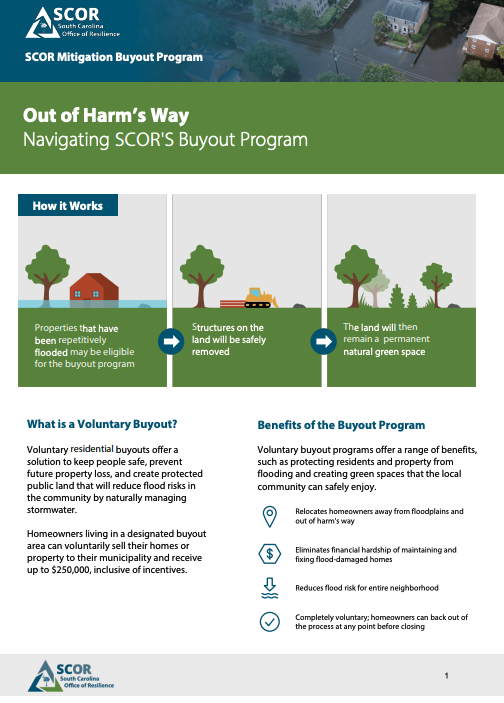

```{r setup, include=FALSE, message=FALSE}
knitr::opts_knit$set(root.dir = normalizePath(".."))
```

```{r}
#| echo: false
#| include: false
#| warning: false

## packages
library(ggplot2)

## load data and recodes 
source("scripts/recodes.R")

sjPlot::set_theme(base = theme_bw())
```


## Motivation

### What influences public support for a property buyout program? 

::: {.incremental}
* Climate change is likely to cause migration and retreat from vulnerable areas 
  * _Increased flooding_  

* Expanding property buyout programs are one approach being considered by governments to manage migration 
:::


## Buyout Program 

::: {.incremental}
* Federal Emergency Management Agency (FEMA)
  * Hazard Mitigation Grant Program (HMGP) 

* Department of Housing and Urban Development (HUD)

* South Carolina Office of Resilience 
  * Funding from HUD Community Development Block Grant-Mitigation (CDBG-MIT)
  * Voluntary 
  * Residential properties in a floodplain 
:::

## Public Support for Buyout Program   

### Potential Factors 

:::: {.columns}

::: {.column width="50%"}

* Flood risk

* Community factors 

* Individual factors 
:::

::: {.column width="50%"}

:::

::::


::: {.notes}
other hazard related variables 
:::

# Data and Analysis 

## Survey 

* Residents of South Carolina
  * Recruited by _Cloud Research_ 
  * November - December 2023 
  * _n_ = ~500

::: {.incremental}  
* Flood days treatment 
  * Random draw from 7-200 days of disruptive flooding
  * Support for buyout program pre-and-post flood days treatment  
:::

## Measures 

### Property Buyout 

_Property buyouts are a policy for reducing risk to people and communities from severe storms, flooding, wildfires, and other extreme events. Buyouts also reduce costs to homeowners, insurance companies, and the government for rebuilding after events. In a buyout program, the government purchases private properties including homes and businesses that are damaged or at risk. Participating property owners must then relocate._

## Measures 

### Property Buyout 

_**On a scale from 1 to 7, with 1 being strongly oppose and 7 being strongly support**, please indicate your support for a property buyout program in South Carolina. In this program the federal government would purchase homes and businesses in South Carolina that have been damaged or at risk from natural disasters and the owners would need to move._  

* **Average support = `r round(mean(scFloodData$buyoutSupportPre, na.rm=TRUE),2)` on the 1 to 7 scale** 

## Measures 

### Flood Risk

::: {.incremental}
* Concern over flooding in local area, _0 to 10 scale_
  * Average concern = `r round(mean(scFloodData$concernFlood, na.rm=TRUE),3)`

* Flood experience, _0 = never experienced a flood, 1 = experienced a flood_ 
  * `r round(mean(scFloodData$floodEx, na.rm=TRUE),2)*100`% of respondents
:::

## Measures 

### Community Factors 

::: {.incremental}
* Satisfaction with community infrastructure (local government services, drinking water, roads, sewer*), _1 to 5 scale_ 
  * Average satisfaction = `r round(mean(scFloodData$infraScale, na.rm=TRUE),2)`
  * Cronbach's $\alpha$ = `r round(infraA$alpha,2)` 
  
* Perceived community resilience and disaster response, _1 to 7 scale_ 
  * Average = `r round(mean(scFloodData$commRel, na.rm=TRUE),2)`
  * Cronbach's $\alpha$ = `r round(commRelA$alpha,2)` 
  
:::

## Measures 

### Community Factors 

::: {.incremental}
* Live in a coastal county, _0 = no, 1 = yes_ 
  * `r round(mean(scFloodData$coastalCount, na.rm=TRUE),2)*100`% of respondents

* Bridging social capital, _1 to 5 scale_ 
  * Average = `r round(mean(scFloodData$scBridge, na.rm=TRUE),2)`
  * Cronbach's $\alpha$ = `r round(scBridgeA$alpha,2)` 
  
:::


## Measures 

### Individual Factors 

::: {.incremental}
* Bonding social capital, _1 to 5 scale_ 
  * Average = `r round(mean(scFloodData$scBond, na.rm=TRUE),2)`
  * Cronbach's $\alpha$ = `r round(scBondA$alpha,2)` 

* Political ideology, _1 (very liberal) to 7 (very conservative) scale_ 
  * Average = `r round(mean(scFloodData$ideology, na.rm=TRUE),2)`

:::

## Measures 

### Individual Factors 

::: {.incremental}
* Homeowner, _0 = no, 1 = yes_ 
  * `r round(mean(scFloodData$ownHome, na.rm=TRUE),2)*100`% of respondents

::: 

* Time at current residence, _1 to 4 scale_ 
  * less than 1 year = 1 
  * 1-5 years = 2 
  * 6-10 years = 3 
  * 11+ years = 4 
  * _Average = `r round(mean(scFloodData$currentAdd, na.rm=TRUE),2)`_ 


# Results 

## Results: Baseline Buyout Support 

* Coefficient plots, grouped by factors 
  * Flood risk 
  * Community 
  * Individuals 

* Results shown control for all variables including demographics (age, gender, race/ethnicity, education, income)

## Results: Baseline Buyout Support

```{r}
#| echo: false
#| include: false
#| warning: false

# buyout support (pre)
summary(supportPreModel <- lm(buyoutSupportPre ~ concernFlood+floodEx+infraScale+commRel+coastalCount+scBridge+scBond+ownHome+currentAdd+ideology+age+male+white+edu+inc, data = scFloodData))

# buyout support (post)
summary(supportPostOwnModel <- lm(buyoutSupportOwn ~ floodDays+concernFlood+floodEx+infraScale+scBond+scBridge+commRel+coastalCount+currentAdd+ideology+age+male+white+edu+inc+buyoutSupportPre, data = scFloodData))

summary(supportPostRentModel <- lm(buyoutSupportRent ~ floodDays+concernFlood+floodEx+infraScale+scBond+scBridge+commRel+coastalCount+currentAdd+ideology+age+male+white+edu+inc+buyoutSupportPre, data = scFloodData))
```

```{r}
#| echo: false
#| warning: false
#| results: asis

floodPrePlot <- sjPlot::plot_model(supportPreModel, terms = c("concernFlood","floodEx"), p.threshold = c(0.10, 0.05, 0.001),  
                         show.values = TRUE, value.offset = .4, colors = "bw", title = "Flood Variables",
                         axis.labels = c("Flood Experience","Flooding Concern")) + ylim(0,1) + xlab("")
floodPrePlot + sjPlot::font_size(title = 25, labels.y = 18)


```

## Results: Baseline Buyout Support

```{r}
#| echo: false
#| warning: false
#| results: asis

commPrePlot <- sjPlot::plot_model(supportPreModel, terms = c("infraScale","commRel","coastalCount","scBridge"), 
                                  p.threshold = c(0.10, 0.05, 0.001),  
                         show.values = TRUE, value.offset = .4, colors = "bw", title = "Community Variables",
                         axis.labels = c("Bridging\nSocial Capital",  "Coastal County", "Community\nResilience",
                                         "Infrastructure\nSatisfaction")) + ylim(0,1) + xlab("")
commPrePlot + sjPlot::font_size(title = 25, labels.y = 18)
```

## Results: Baseline Buyout Support

```{r}
#| echo: false
#| warning: false
#| results: asis

indivPrePlot <- sjPlot::plot_model(supportPreModel, terms = c("scBond","ownHome","currentAdd","ideology"), 
                                  p.threshold = c(0.10, 0.05, 0.001),  
                         show.values = TRUE, value.offset = .4, colors = "bw", title = "Individual Variables",
                         axis.labels = c("Political Ideology\n(more conservative)", "Time at Current\nAddress",
                                         "Own Home", "Bonding\nSocial Capital")) + ylim(-1,1) + xlab("")
indivPrePlot + sjPlot::font_size(title = 25, labels.y = 18)
```

## Results: Flood Days and Buyout Support

* Homeowners and renters 
  * Homeowner willing to accept buyout, _1 (very unlikely) to 7 (very likely) scale_
  * Renters support for buyout program 

* Results shown control for all variables including _baseline buyout support_ and demographics (age, gender, race/ethnicity, education, income)

## Results: Flood Days and Buyout Support

:::: {.columns}

::: {.column width="50%"}
```{r}
#| echo: false
#| warning: false
#| results: asis
ggplot(scFloodData, aes(x=floodDays, y=buyoutSupportOwn)) + 
  geom_smooth(color = "black") +
  labs(title="Flood Days and Likelihood of Accepting Buyout (Home Owners)", 
       caption = "",
       x="Number of Flood Days", y = "Likey to Accept Buyout (1-5 scale)") +
  theme_minimal() +
  theme(plot.title = element_text(face = "bold"),
        plot.caption = element_text(face = "italic")) +
  scale_fill_grey()
```

:::

::: {.column width="50%"}
```{r}
#| echo: false
#| warning: false
#| results: asis
ggplot(scFloodData, aes(x=floodDays, y=buyoutSupportRent)) + 
  geom_smooth(color = "black") +
  labs(title="Flood Days and Likelihood of Supporting Buyout (Renters)", 
       caption = "",
       x="Number of Flood Days", y = "Likey to Support Buyout (1-5 scale)") +
  theme_minimal() +
  theme(plot.title = element_text(face = "bold"),
        plot.caption = element_text(face = "italic")) +
  scale_fill_grey()
```

:::

::::

## Results: Post-Buyout Support

```{r}
#| echo: false
#| warning: false
#| results: asis

sjPlot::plot_models(supportPostOwnModel, supportPostRentModel,
                    m.labels = c("Own Home","Rent"),
                    rm.terms = c("buyoutSupportPre","inc","edu","white","male","age",
                                 "ideology","currentAdd","coastalCount","commRel","scBridge",
                                 "scBond","infraScale"),
                    p.threshold = c(0.10, 0.05, 0.001),
                    show.values = TRUE,
                    title = "Flood Variables",
                    axis.labels = c("Flood Experience","Flooding Concern", "Number of\nFlood Days")) + xlab("")
```

## Results: Post-Buyout Support

```{r}
#| echo: false
#| warning: false
#| results: asis

sjPlot::plot_models(supportPostOwnModel, supportPostRentModel,
                    m.labels = c("Own Home","Rent"),
                    rm.terms = c("buyoutSupportPre","inc","edu","white","male","age",
                                 "ideology","scBond","currentAdd","floodEx","concernFlood","floodDays"),
                    p.threshold = c(0.10, 0.05, 0.001),
                    show.values = TRUE,
                    title = "Community Variables",
                    axis.labels = c("Bridging\nSocial Capital", "Community\nResilience", "Coastal County",
                                         "Infrastructure\nSatisfaction")) + xlab("")

```

## Results: Post-Buyout Support

```{r}
#| echo: false
#| warning: false
#| results: asis

sjPlot::plot_models(supportPostOwnModel, supportPostRentModel,
                    m.labels = c("Own Home","Rent"),
                    rm.terms = c("buyoutSupportPre","inc","edu","white","male","age",
                                "coastalCount","commRel","scBridge",
                                 "infraScale","floodEx","concernFlood","floodDays"), 
                                  p.threshold = c(0.10, 0.05, 0.001),  
                         show.values = TRUE, title = "Individual Variables",
                         axis.labels = c("Political Ideology\n(more conservative)", "Time at Current\nAddress",
                                         "Bonding\nSocial Capital")) + xlab("")

```

## Discussion 

### Baseline support 

::: {.incremental}
* Flood risk (concern and experience)

* Community factors 
  * **Increased community satisfaction (infrastructure, resilience, bridging social capital) associated with _increased_ support**
  * Coastal county residents more supportive than others 

* Individual factors 
  * Increased bonding social capital, longer at current address, and more politically conservative associated with _decreased_ support 
:::

## Discussion 

### Post-support 

::: {.incremental}
* Homeowners 
  * Increased flood days associated with small increase in likelihood of accepting a buyout 

* Renters 
  * Infrastructure satisfaction associated with _increased_ support
  * Less perceived community resilience associated with _increased_ support
:::

## 

Comments and Questions 